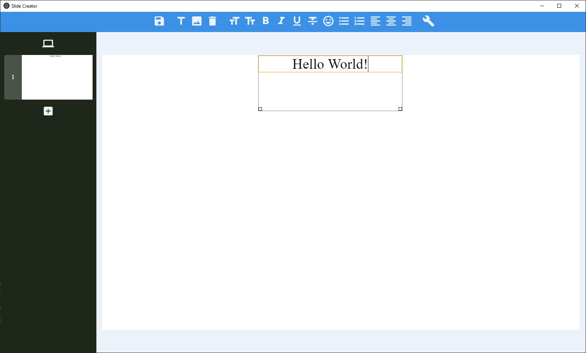
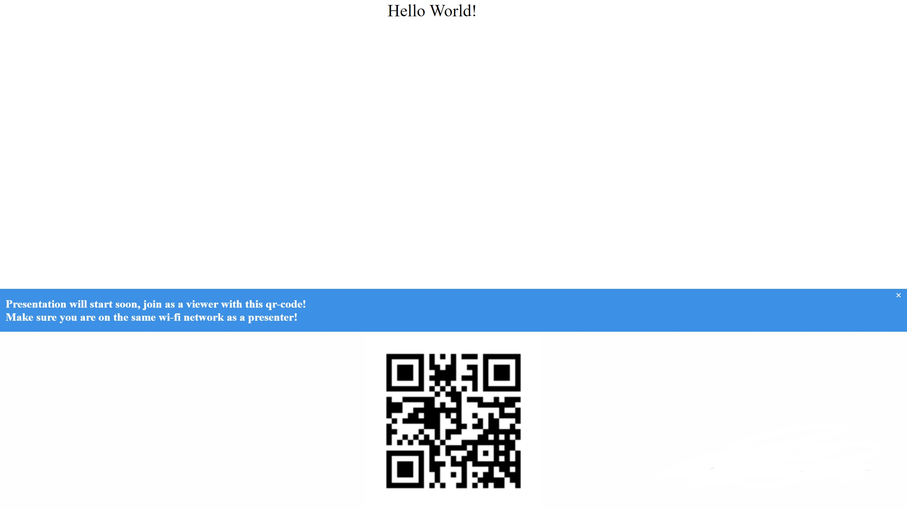

# InterSlides
Application for creating viewer-interactive presentations

## Create

Create awesome slides with simple slide editor

## Show

Show your presentations to public and invite your viewers to interact with your presentation and you!

# WIP!

This app is work in progress! Many standards can change and .is files can be incompatible with newer versions

# Platforms
Version 0.1.0 provides only windows version (with auto-updating), but deb/rpm/snap/flatpak packages are on the way!
